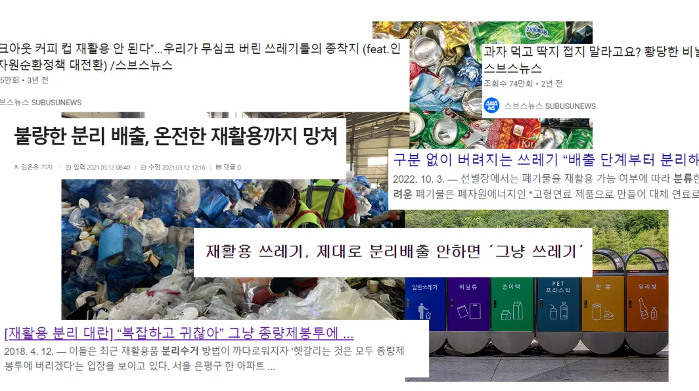
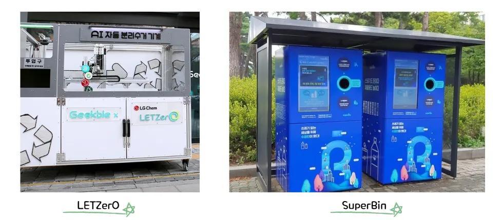
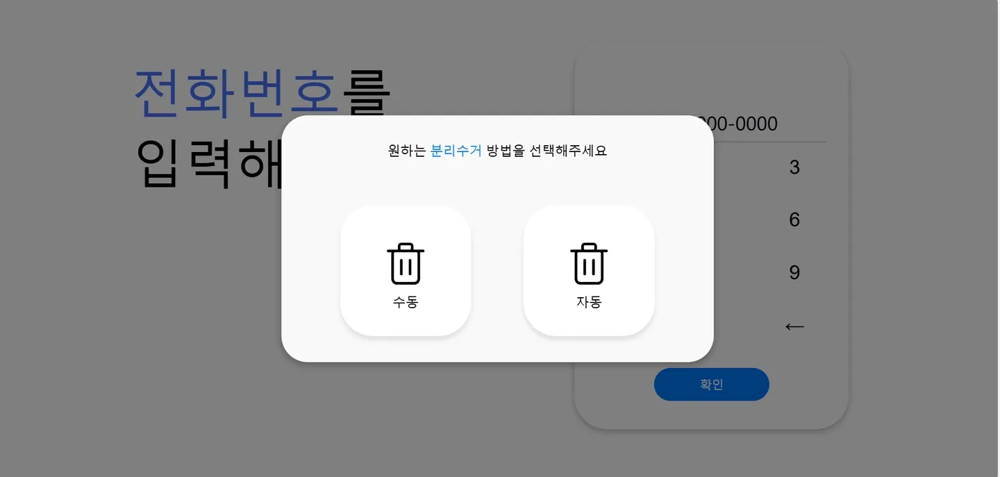
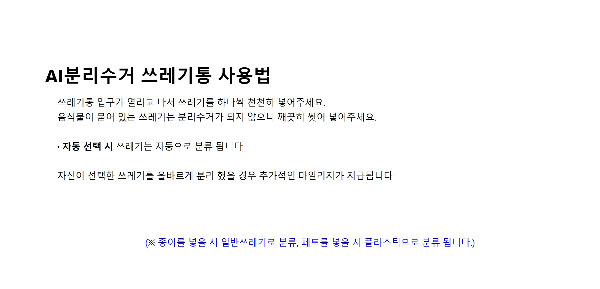
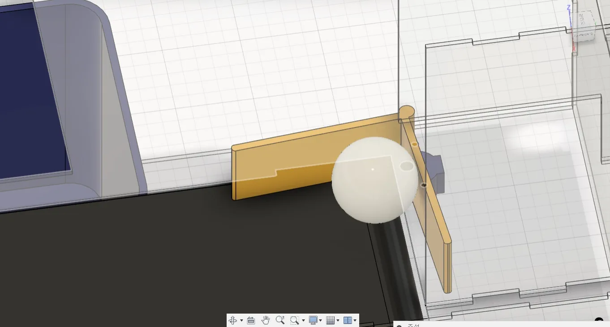
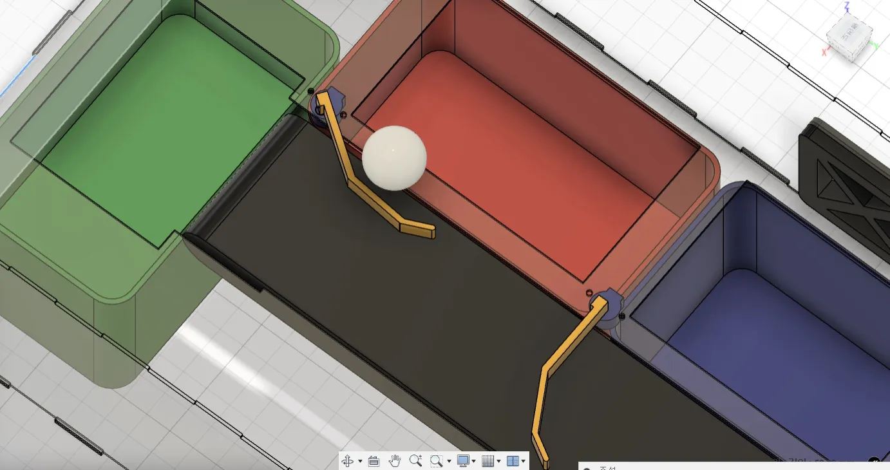
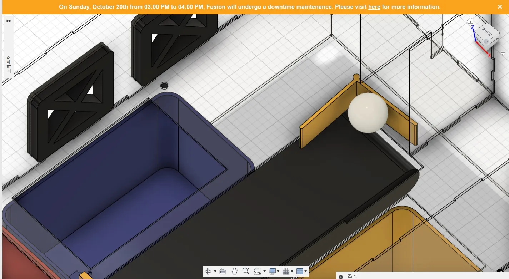
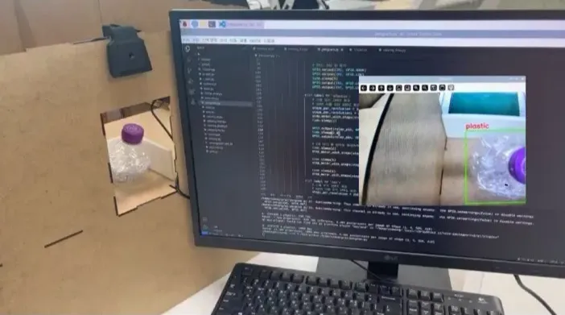
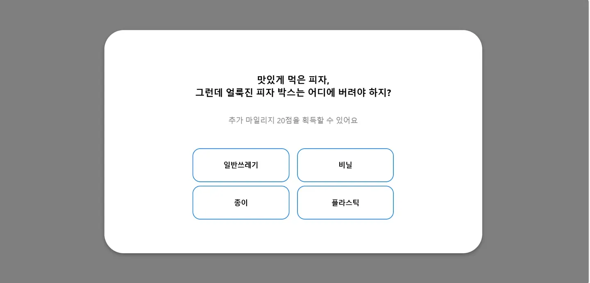
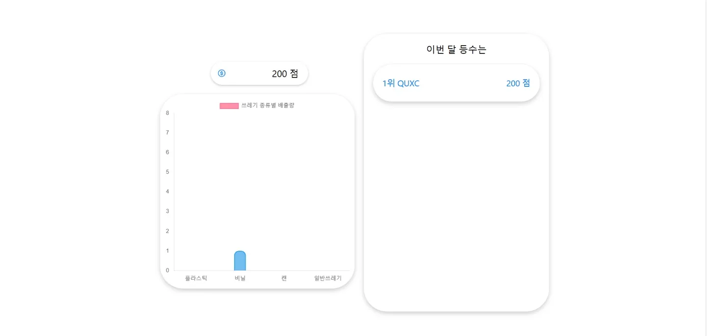

# viewing

## 🗒️ 개발 동기

- 대한민국의 재활용률은 2022년 기준으로 87.6%로 OECD 국가 중 2위를 기록하고 있다
- 하지만 잘못된 분리수거 방식으로 폐기물의 실제 재활용률은 약 16.4%에 불과하다
- 그 이유는 설문 조사에 응한 시민 대부분이 재활용 방법을 알고 있다고 답했지만, 실제로 올바른 재활용 기준과는 거리가 있었다
- 교육의 대상이 되는 학생들은 직접 참여할 수 있는 체험형 교육 방식을 선호하는 추세이다

## 🟰 유사 서비스 분석 / 시장 분석

**LETZerO 의 한계점**

- 많은 쓰레기 종류 중 플라스틱만 분리 가능
- 유리창을 통한 단순히 분리되는 과정만 보여줌
- 사용자에게 교육적으로 도움되는 부분이 적음

**SuperBin의 한계점**

- 페트병과 캔만 분리 가능
- 단순히 기계에 넣는 방식이라 사용자의 흥미 유도 불가

**시장 분석을 바탕으로 작성한 뷰잉의 SWOT**

**Strength (장점)**

- AI 기술 활용
- 사용자 맞춤 경험
- 교육 효과
- 사회적 가치 창출

**Weakness (약점)**

- 기술 의존성
- 초기 비용 및 유지 관리 필요

**Opportunity (기회)**

- 환경 의식 향상 추세
- 사회적 책임 투자 및  ESG 트렌드
- 학교 및 교육 기관 도입

**Threat (위협)**

- 경쟁 시스템 증가
- 기술적 한계

**LETZerO 와 뷰잉의 시스템 비교**

## 🧑🏻‍💻 주요 기능

### **1. 웹페이지 - 분리수거 방법 (자동/수동) 선택**

- 전화번호를 통한 회원가입
- 분리수거 방법(자동/수동) 선택
    - 자동 : 사용자는 AI 카메라가 인식한 쓰레기 종류에 따라 분리되는 과정 볼 수 있음 (마일리지 제공 X)
    - 수동 : 사용자가 생각한 쓰레기 종류와 AI 카메라가 인식한 쓰레기 종류를 비교하여 값의 일치 여부에 따라 추가 마일리지 지급 (맞으면 100, 틀리면 50)
- 올바른 재활용 방법 교육 문구
    - AI 카메라가 쓰레기 종류를 인식하는 시간 동안만 띄움

### 2. AI 카메라 - 쓰레기 인식 및 자동 분류

- 사진 상의 입구에 설치된 AI 카메라로 쓰레기 종류 인식이 끝나면 입구의 ‘ㄱ’자 바를 통해 컨베이어 벨트까지 쓰레기 이동

- AI 카메라가 인식한 쓰레기 종류 (비닐/플라스틱/캔/일반쓰레기)에 따른 자동 분류
- ‘캔’ or ‘플라스틱’을 인식한 경우
    
    : 사진상의 바를 통해 각 위치로 분류
    
- ‘일반쓰레기’를 인식한 경우
    
    : 컨베이어 벨트를 통해 위치로 분류
    

- ‘비닐’을 인식한 경우
    : 사진상의 두 개의 팬을 이용한 바람을 통해 위치로 분류    

- openCV와 YOLOv8을 활용한 이미지 라벨링으로 학습된 플라스틱을 인식하는 모습

### 3. 교육을 위한 분리수거 상식 문제 제공

- 다양한 분리수거와 관련된 기본 상식 문제를 하드웨어 동작이 종료된 후 제공
- 정답 여부에 따라 마일리지 20점 추가 제공
- 정답 여부와 그에 따른 해설 제공

### 4. 마일리지 랭킹 확인 및 자신이 분리수거 한 쓰레기 종류 확인

- 앞서 선택한 분리수거 방법과 추가 질문을 통해 모은 마일리지 점수와 자신의 랭킹을 확인할 수 있음
- 자신이 버린 쓰레기의 종류 개수의 차트를 확인할 수 있음
- 자신의 랜덤 아이디 4자리 또한 이 페이지에서 확인하여 다음 번에 같은 전화번호를 통해 회원가입할 경우 동등한 아이디에 마일리지가 적립됨

## 🎁 기대 효과

### 올바른 재활용 방법 교육

- 분리수거 방법(수동)에서 자신이 알고 있는 쓰레기 종류와 AI가 인식한 쓰레기 종류를 비교하여 자신의 분리수거 지식을 확인할 수 있음
- 자동 분리되는 과정을 지켜 본 사용자는 올바른 쓰레기 종류를 다시 한 번 상기 가능
- 하드웨어 동작이 끝난 후 사용자는 추가 분리수거 상식 질문을 통해 사람들이 보통 헷갈려하는 질문을 풀며 교육의 효과를 볼 수 있음

### 사회적 가치 창출 가능

- 사회적으로 이슈인 환경 문제를 기반으로 만들어진 시스템이므로 요즘 큰 문제로 제기되고 있는 미래의 환경에 큰 이바지할 수 있음
- 단지 분리수거 시스템이 아닌 교육 시스템이므로 시민 공원 또는 학교에 도입하여 학생들에게 올바른 분리수거 방법을 교육할 수 있음
- 랭킹 페이지를 통해 정부 또는 교육청에서 재활용과 관련된 상품을 전달할 수 있음

### 사용자간의 긍정적인 경쟁심 유도

- 랭킹 페이지를 통해 자신의 위치를 파악한 사용자들간의 긍정적인 경쟁심 유도 가능
- 시중에 있는 단순한 기계에 쓰레기를 넣는 방식이 아닌 사용자 체험형 방식이기 때문에 단순히 호기심에 한 번 시도하는 것으로 그치지 않고 계속해서 관심을 가질 수 있음

## 👩🏻‍💻 개발환경

**HW**
- Raspberry Pi

**AI**
- openCV
- YOLO

**Web**
- React
- Flask

**Design**
- Figma
- Fusion 360

## 🧑‍🤝‍🧑 팀원

| 이름 | 역할 |
| --- | --- |
| 김은혜 | 팀장, AI |
| 박초영 | HW, PM |
| 이승주 | HW, PM |
| 김규림 | Web/HW Design |
| 김은서 | HW Design |
| 김혜미 | Front-end |
| 성현서 | Back-end |
>>>>>>> 75a06be (README)
